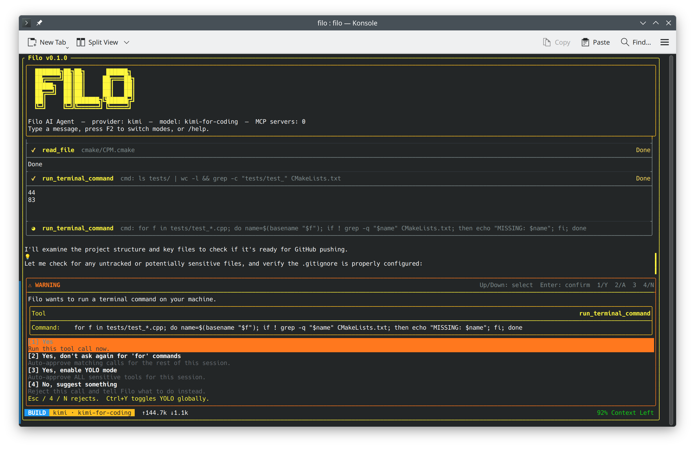

# Filo

<p align="center">
  
</p>

**Filo** is a high-performance AI coding assistant written in modern C++.

It runs in multiple runtime modes:
- interactive terminal app (TUI)
- non-interactive prompter mode for scripts/CI
- MCP server over stdio
- HTTP daemon exposing MCP and/or OpenAI/Anthropic-compatible API endpoints

## Why Filo

Filo focuses on speed, control, and local-first workflows without giving up multi-provider flexibility.

## What Is Different In Filo

### 1) Local-first architecture

- Local providers are first-class: Ollama over localhost and embedded `llama.cpp` for in-process GGUF inference( `FILO_ENABLE_LLAMACPP=ON`).
- Router guardrails can exempt providers flagged as local (`enforce_on_local: false`), keeping embedded local backends available when remote limits are hit.
- The daemon listens on `127.0.0.1` by default.

### 2) Embedded smart routing

- In-process router engine with policy rules and strategies: `smart`, `fallback`, `latency`, `load_balance`.
- Automatic fallback chains with per-candidate retries.
- Guardrails for spend and quota reserves (`max_session_cost_usd`, token/request/window reserve ratios).
- Auto-classifier that scores prompt complexity and routes to fast/balanced/powerful tiers.

### 3) Embedded Python runtime

- Built-in `python` tool executes code inside an embedded interpreter.
- Interpreter state persists across calls (variables/imports/functions carry over).
- Optional venv isolation via `FILO_PYTHON_VENV`.

## Feature Highlights

- C++26 core with streaming-first provider protocols
- TUI built with FTXUI
- Context mentions (`@file`, quoted paths, and escaped paths like `@My\ Folder/file.txt`)
- `Ctrl+V` clipboard paste support (text paste and clipboard-image insertion as `@"<path>"`)
- Session persistence and resume
- Global + workspace config layering
- MCP dispatcher shared across stdio and HTTP transports
- OAuth and API-key credentials

## Prerequisites

- CMake `>= 3.28`
- C++26 compiler (GCC 15+ or Clang 17+ recommended)
- OpenSSL
- Python 3 (required when `FILO_ENABLE_PYTHON=ON`, which is the default)

## Build And Run

### Linux

```bash
cmake --preset linux-debug
cmake --build --preset linux-debug
ctest --preset linux-debug --output-on-failure
./build/Linux/linux-debug/filo
```

### macOS

```bash
cmake --preset xcode-debug
cmake --build --preset xcode-debug
ctest --preset xcode-debug --output-on-failure
./build/Darwin/xcode-debug/Debug/filo
```

## Enable Embedded `llama.cpp`

Linux:

```bash
cmake --preset linux-debug -DFILO_ENABLE_LLAMACPP=ON
cmake --build --preset linux-debug
```

Minimal local provider example:

```json
{
  "default_provider": "local",
  "providers": {
    "local": {
      "api_type": "llamacpp",
      "model": "qwen2.5-coder-7b",
      "model_path": "/absolute/path/to/model.gguf",
      "context_size": 8192,
      "gpu_layers": 35
    }
  }
}
```

## Runtime Modes

| Mode | Command |
|---|---|
| Interactive TUI | `filo` |
| Prompter (single-shot) | `filo --prompt "Summarize this diff"` |
| MCP over stdio | `filo --mcp --headless` or `filo --mcp stdio --headless` |
| MCP over TCP (HTTP `/mcp` endpoint) | `filo --mcp tcp --headless --port 8080` |
| API gateway only | `filo --api --headless --port 8080` |
| MCP + API gateway | `filo --mcp tcp --headless --api --port 8080` |

Daemon transport notes:
- `--mcp` without a value defaults to `stdio`.
- `--mcp tcp` starts the HTTP daemon and exposes MCP on `/mcp`.
- `--daemon` is still accepted as a deprecated alias for `--mcp tcp`.
- The API gateway is off by default to keep daemon startup minimal and local-first.
- `--api` starts the same HTTP daemon and exposes OpenAI/Anthropic-compatible proxy endpoints:
  - `GET /v1/models`
  - `POST /v1/chat/completions` (OpenAI-style)
  - `POST /v1/messages` (Anthropic-style)
- Combine `--api` with `--mcp tcp` if you want both `/mcp` and `/v1/*` on one port.
- Model routing in API gateway endpoints:
  - `policy/<policy_name>` routes via filo smart router policy.
  - `<provider>/<model>` routes directly to a configured provider/model.
  - `<provider>` routes to that provider's default configured model.

Useful CLI flags:
- `--mcp [stdio|tcp]` run as MCP server (default transport: `stdio`)
- `--daemon` deprecated alias for `--mcp tcp`
- `--api` enable optional OpenAI/Anthropic-compatible proxy mode
- `--login <provider>` authenticate and exit (`openai` uses ChatGPT OAuth)
- `--list-sessions` list resumable sessions
- `--resume [id|index]` resume a saved session
- `--prompter` force non-interactive mode
- `--prompt`, `-p` prompt text
- `--output-format`, `-o` one of `text`, `json`, `stream-json`
- `--input-format` one of `text`, `stream-json`
- `--include-partial-messages` include deltas in `stream-json`
- `--continue` continue the latest project-scoped session in prompter mode

Prompter examples:

```bash
# Direct prompt
filo --prompt "Review this patch for regressions"

# Stdin only
git diff | filo

# Prompt + stdin context
cat README.md | filo --prompt "Summarize the key setup steps"

# JSON output for automation
filo -p "Generate release notes from these commits" -o json

# Stream JSON events
filo -p "Explain the architecture" -o stream-json --include-partial-messages

# Continue latest project-scoped session
filo --continue -p "Now apply the follow-up refactor"
```

## Provider Setup

Filo supports both API-key and OAuth-based providers.

Typical API-key setup:

```bash
export XAI_API_KEY="..."
export OPENAI_API_KEY="..."
export ANTHROPIC_API_KEY="..."
export GEMINI_API_KEY="..."
export MISTRAL_API_KEY="..."
export KIMI_API_KEY="..."
export DASHSCOPE_API_KEY="..."
```

For local Ollama, default endpoint is:
- `http://localhost:11434`

## Configuration

Config files are layered in this order:

1. `~/.config/filo/config.json`
2. `~/.config/filo/auth_defaults.json`
3. `~/.config/filo/settings.json`
4. `./.filo/config.json`
5. `./.filo/settings.json`
6. `~/.config/filo/profile_defaults.json`
7. `~/.config/filo/model_defaults.json`

Use `config.json` for providers/router/subagents.
Use `settings.json` for managed UI/workflow preferences.

### Profiles

Profiles let you keep multiple named configuration overlays and switch between them instantly.
This is useful for context switching (for example: `work`, `oss`, `local`), without rewriting
your main config each time.

What profiles support:

- Define named overlays under `profiles` in `config.json`
- Inherit from one or more parent profiles with `extends_from`
- Override normal config fields (provider/model selection, mode, approval mode, router, MCP servers, subagents, UI defaults)
- Switch in TUI with `/profile <name>` and apply changes live in the current session
- Persist the active profile in `~/.config/filo/profile_defaults.json` for future launches

Example profile config:

```json
{
  "profiles": {
    "work": {
      "description": "Company defaults",
      "default_provider": "openai",
      "default_mode": "BUILD"
    },
    "oss": {
      "extends_from": ["work"],
      "default_provider": "grok",
      "default_approval_mode": "prompt"
    }
  }
}
```

Quick usage:

1. Define profiles under `profiles` in `~/.config/filo/config.json` or `./.filo/config.json`.
2. In TUI, run `/profile` (or `/profile list`) to see active and available profiles.
3. Switch profile with `/profile <name>` (for example `/profile work`).
4. Remove the persisted profile with `/profile clear`.

Commands:

```bash
/profile
/profile list
/profile work
/profile oss
/profile clear
```

Precedence note: `FILO_PROFILE=<name>` forces a profile for that process and overrides the persisted selection until unset.

### Smart router with local-first policy example

```json
{
  "router": {
    "enabled": true,
    "default_policy": "local-first",
    "guardrails": {
      "max_session_cost_usd": 5.0,
      "min_requests_remaining_ratio": 0.20,
      "min_tokens_remaining_ratio": 0.20,
      "min_window_remaining_ratio": 0.20,
      "enforce_on_local": false
    },
    "policies": {
      "local-first": {
        "strategy": "fallback",
        "defaults": [
          { "provider": "local", "model": "qwen2.5-coder-7b", "retries": 0 },
          { "provider": "ollama", "model": "llama3", "retries": 0 },
          { "provider": "grok", "model": "grok-code-fast-1", "retries": 1 }
        ],
        "rules": [
          {
            "name": "deep-reasoning",
            "priority": 10,
            "strategy": "fallback",
            "when": {
              "min_prompt_chars": 260,
              "any_keywords": ["debug", "root cause", "architecture", "migration"]
            },
            "candidates": [
              { "provider": "claude", "model": "claude-sonnet-4-6", "retries": 1 },
              { "provider": "grok-reasoning", "model": "grok-4.20-reasoning", "retries": 1 }
            ]
          }
        ]
      }
    }
  }
}
```

## Architecture Snapshot

- `src/core/llm/` provider abstraction, protocols, routing
- `src/core/tools/` tool execution (shell/files/patch/search/python)
- `src/core/mcp/` MCP dispatcher and client/session handling
- `src/tui/` terminal UI components
- `src/exec/` stdio MCP server, daemon, and prompter entrypoints
- `src/core/auth/` API key and OAuth flows

## License

Apache License 2.0. See [LICENSE](LICENSE).
