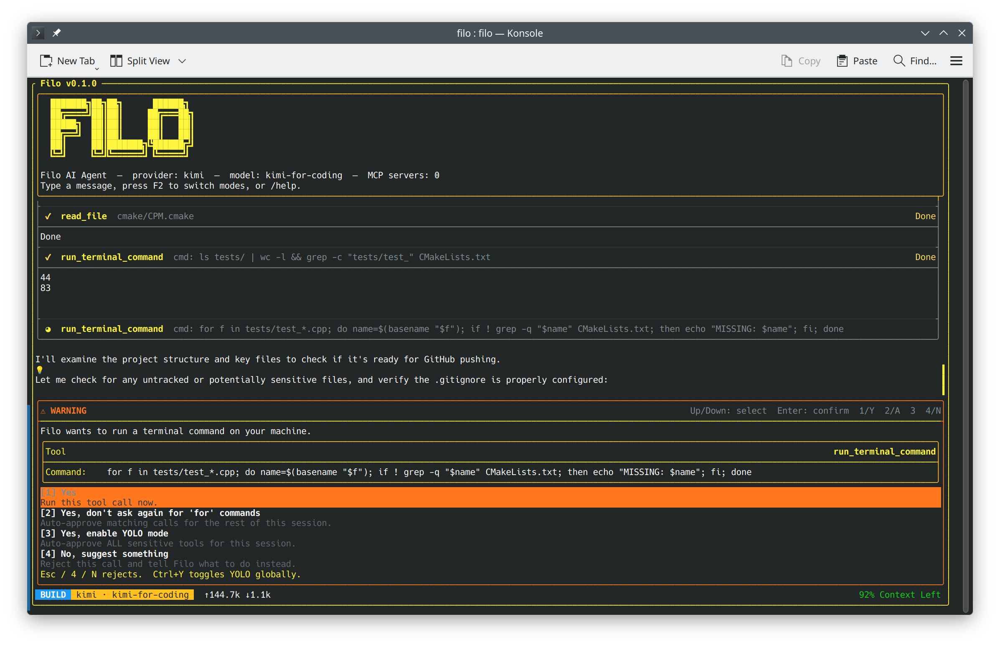

# Filo

<p align="center">
  
</p>

**Filo** is a high-performance AI coding assistant written in modern C++.

It began as the *handyman* for [Lampo](https://apps.apple.com/app/lampo/id6760648195): the private, on-device AI workspace for Apple Silicon. Lampo ships on the Mac App Store under App Sandbox, so it cannot freely reach the filesystem, shell, or developer tooling. Filo was built to sit beside it and do that work: open projects, read and write files, search code, apply patches, and run commands when Lampo’s models need real hands on the machine.

After those early days, Filo grew into a fully fledged terminal coding agent that stands on its own. You can run it end-to-end without Lampo: interactive TUI, skills, session resume, and non-interactive prompter mode for scripts and CI. The Lampo partnership remains first-class when you want it.

Because Filo is written in modern C++, it can be compiled with embedded [llama.cpp](https://github.com/ggml-org/llama.cpp) (`FILO_ENABLE_LLAMACPP=ON`) and run local GGUF models **in-process**, no separate inference server required. Pair that with any remote providers you configure, and Filo’s built-in **smart router** can blend them: prefer local for everyday work, fall back or escalate to remote when a task needs more capacity, and keep spend/quota guardrails under your control.

It runs in multiple runtime modes:
- interactive terminal app (TUI)
- non-interactive prompter mode for scripts/CI
- MCP server over stdio
- HTTP daemon exposing MCP and/or compatible chat API endpoints

Switch models with `--model` or `/model` — local, hybrid, or remote, no lock-in.

<table>
<tr><td><b>A real terminal interface</b></td><td>Full FTXUI TUI with streaming tool output, slash-command autocomplete, session resume, context mentions, and clipboard image paste.</td></tr>
<tr><td><b>Embedded local AI</b></td><td>C++ core can link <code>llama.cpp</code> for in-process GGUF inference; Ollama over localhost is first-class too. The HTTP daemon binds <code>127.0.0.1</code> by default.</td></tr>
<tr><td><b>Smart hybrid routing</b></td><td>In-process policies (<code>smart</code>, <code>fallback</code>, <code>latency</code>, <code>load_balance</code>) mix local and remote backends with automatic fallback, spend/quota guardrails, and complexity-based tier routing.</td></tr>
<tr><td><b>MCP server and client</b></td><td>Expose Filo’s coding tools to hosts such as Lampo, or connect Filo to external MCP servers over stdio or Streamable HTTP.</td></tr>
<tr><td><b>Prompter for automation</b></td><td>Single-shot and streaming modes for scripts and CI, with <code>text</code>, <code>json</code>, and <code>stream-json</code> output formats.</td></tr>
<tr><td><b>Agent Skills</b></td><td>On-demand instruction packages under <code>.filo/skills</code>, slash-command activation, and compatibility with common skill roots.</td></tr>
<tr><td><b>Embedded Python</b></td><td>Persistent in-process interpreter tool with optional <code>FILO_PYTHON_VENV</code> isolation.</td></tr>
</table>

---

## Quick Start

### Prerequisites

- CMake `>= 3.28`
- C++26 compiler (GCC 15+ or Clang 17+ recommended)
- OpenSSL
- Python 3 (required when `FILO_ENABLE_PYTHON=ON`, which is the default)

## Build And Run

### Linux

```bash
cmake --preset linux-debug
cmake --build --preset linux-debug
ctest --preset linux-debug --output-on-failure
cmake --build --preset linux-debug --target run_integration_tests
./build/Linux/linux-debug/filo
```

### macOS

```bash
cmake --preset xcode-debug
cmake --build --preset xcode-debug
ctest --preset xcode-debug --output-on-failure
cmake --build --preset xcode-debug --target run_integration_tests
./build/Darwin/xcode-debug/Debug/filo
```

### Install

```bash
# Linux
cmake --install build/Linux/linux-debug --prefix "$HOME/.local"

# macOS (Xcode preset — select the configuration explicitly)
cmake --install build/Darwin/xcode-debug --config Debug --prefix "$HOME/.local"
```

The executable is installed to `<prefix>/bin/filo`. Verify with `filo --version`.

Configure providers and credentials from the TUI (`/settings`, `/model`, `/login`) or your preferred environment. Local backends such as Ollama (`http://localhost:11434` by default) and embedded `llama.cpp` need no cloud keys.

---

## What Makes Filo Different

### Local-first architecture

- Local providers are first-class: Ollama over localhost and embedded `llama.cpp` for in-process GGUF inference (`FILO_ENABLE_LLAMACPP=ON`).
- Router guardrails can exempt providers flagged as local (`enforce_on_local: false`), keeping embedded local backends available when remote limits are hit.
- The daemon listens on `127.0.0.1` by default.

### Embedded smart routing

- In-process router engine with policy rules and strategies: `smart`, `fallback`, `latency`, `load_balance`.
- Automatic fallback chains with per-candidate retries.
- Provider health memory: rate limits parsed from real response headers (`retry-after`, subscription window resets) cool a provider down across requests instead of re-hammering it, and a circuit breaker backs off repeatedly failing providers.
- Optional wait-for-reset failover: when every routed provider is rate-limited, the router can park the turn until the soonest provider reset and resume automatically — overnight jobs finish without anyone typing "continue".
- Guardrails for spend and quota reserves (`max_session_cost_usd`, token/request/window reserve ratios).
- Auto-classifier that scores prompt complexity and routes to fast/balanced/powerful tiers.

### Embedded Python runtime

- Built-in `python` tool executes code inside an embedded interpreter.
- Interpreter state persists across calls (variables/imports/functions carry over).
- Optional venv isolation via `FILO_PYTHON_VENV`.

### Feature highlights

- C++26 core with streaming-first provider protocols
- TUI built with FTXUI
- Context mentions (`@file`, quoted paths, and escaped paths like `@My\ Folder/file.txt`)
- Agent Skills support with `.filo/skills` and on-demand activation
- `Ctrl+V` clipboard paste support (text paste and clipboard-image insertion as `@"<path>"`)
- First-class thread management (`Ctrl+N` new thread, `/threads` for active runtimes; `Ctrl+H`/`Ctrl+J` aliases on enhanced-keyboard terminals) — project-named tabs let you switch without tmux/screen while hidden threads keep working. On an empty prompt, `Ctrl+D` archives and closes the current idle secondary thread; the main thread retains double-`Ctrl+D` app exit. In `/threads`, `C` closes any idle non-main thread without deleting its saved session. `/sessions` remains the saved-conversation manager.
- Session persistence and resume
- Global + workspace config layering
- MCP dispatcher shared across stdio and HTTP transports
- OAuth and API-key credentials

### Agent execution modes

| Mode | Behaviour |
|---|---|
| `AUTO` | Routes each request to direct execution, orchestration, or Boost; escalates failed verification automatically |
| `BUILD` | General-purpose single-agent software workflow |
| `DEBUG` | Enforces a reproduce → inspect → fix → verify loop |
| `RESEARCH` | Read-only analysis and planning |
| `EXECUTE` | Applies instructions directly, keeping permission checks |

For orchestrated turns AUTO plans a small typed DAG and runs only its independent read-only
frontier through subagents, while the parent stays the single writer. It records the starting
branch, revision, and dirty paths, then audits the final state so branch/HEAD transitions or lost
pre-existing changes cannot pass silently.

A turn that changed the workspace must end with fresh verification evidence. On `stop` Filo runs
project completion hooks; a successful hook marked `quality_gate` is authoritative. Otherwise AUTO
runs the smallest deterministic gate from the repository recipe catalog, discovered from CMake
presets, package scripts, Cargo, Go, Swift, Maven, and Gradle metadata. The `run_verification`
tool executes recipes as argv arrays — never a model-authored shell string — and returns typed
receipts; evidence is bound to the latest mutation, so a later edit invalidates it.

Teams can declare portable, shell-free recipes in `.filo/verification.json`:

```json
{
  "version": 1,
  "recipes": [
    {
      "id": "quality",
      "kind": "test",
      "executable": "ctest",
      "arguments": ["--preset", "linux-debug", "--output-on-failure"],
      "required": true
    }
  ]
}
```

Kinds are `build`, `test`, `lint`, `typecheck`, `format`, `workflow`, and `custom`. Recipes remain
subject to workspace confinement, tool policy, timeouts, and permission prompts, and a remembered
permission is scoped to that recipe rather than every future verification.

Hook events are `user_prompt_submit`, `pre_tool_use`, `post_tool_use`, `post_tool_batch`, and
`stop`, each accepting an optional `matcher` regex over the JSON payload plus `fail_closed` and
`quality_gate` flags. Payloads arrive on stdin and in `FILO_HOOK_PAYLOAD_B64`. A `stop` hook passes
on exit `0` and can request another turn with exit `2` or `{"decision":"block","reason":"…"}`;
repeated feedback is capped at three turns so a broken hook cannot loop forever.

---

## Runtime Modes

| Mode | Command |
|---|---|
| Interactive TUI | `filo` |
| Prompter (single-shot) | `filo --prompt "Summarize this diff"` |
| MCP over stdio | `filo --mcp stdio` or `filo --mcp stdio --headless` |
| MCP over TCP (HTTP `/mcp` endpoint) | `filo --mcp --headless --port 8080` or `filo --mcp tcp --headless --port 8080` |
| API gateway only | `filo --api --headless --port 8080` |
| MCP + API gateway | `filo --mcp --headless --api --port 8080` |

### Daemon / transport

- `--mcp` without a value defaults to `tcp`.
- `--mcp tcp` starts the HTTP daemon and exposes MCP on `/mcp`.
- `--mcp stdio` runs an MCP server over standard input/output (headless).
- `--daemon` is still accepted as a deprecated alias for `--mcp tcp`.
- Set `FILO_MCP_BEARER_TOKEN` to require `Authorization: Bearer <token>` on `/mcp`.
- For LAN worker deployments, use `--host 0.0.0.0` only with a bearer token and network access controls.
- The API gateway is off by default to keep daemon startup minimal and local-first.
- `--api` starts the same HTTP daemon and exposes compatible chat proxy endpoints:
  - `GET /v1/models`
  - `POST /v1/chat/completions`
  - `POST /v1/messages`
- Combine `--api` with `--mcp` if you want both `/mcp` and `/v1/*` on one port.
- Model routing in API gateway endpoints:
  - `policy/<policy_name>` routes via Filo smart router policy.
  - `<provider>/<model>` routes directly to a configured provider/model.
  - `<provider>` routes to that provider's default configured model.

### Useful CLI flags

- `--version` print the Filo version and exit
- `--mcp [tcp|stdio]` run as MCP server (default transport: `tcp`)
- `--daemon` deprecated alias for `--mcp tcp`
- `--api` enable optional chat API proxy mode
- `filo --auth <provider> [login|logout]` authenticate or sign out and exit
- `--list-sessions` list resumable sessions
- `--model <MODEL|PROVIDER|PROVIDER/MODEL>` select a model for this process only without changing saved defaults
- `-r, --resume [id|index|name]` resume a saved session (names are set with `/rename`)
- `--prompter` force non-interactive mode
- `--prompt`, `-p` prompt text
- `--output-format`, `-o` one of `text`, `json`, `stream-json`
- `--input-format` one of `text`, `stream-json`
- `--include-partial-messages` include deltas in `stream-json`
- `-c, --continue` continue the latest project-scoped session (TUI + prompter)
- `--work-dir`, `-w` add a workspace directory; the first one is primary and later ones are additional allowed directories
- `--sandbox [read-only|workspace-write|off]` controls `landrun` (default: `off`); bare `--sandbox` enables `workspace-write`. `read-only` blocks workspace mutations from both native file tools and child processes while preserving a writable private temp root. Opt-in secure modes use native Landlock + seccomp on Linux and the native Seatbelt SPI on macOS—never `sandbox-exec`—and deny child network access.

### Prompter examples

```bash
# Direct prompt
filo --prompt "Review this patch for regressions"

# Stdin only
git diff | filo

# Prompt + stdin context
cat README.md | filo --prompt "Summarize the key setup steps"

# JSON output for automation
filo -p "Generate release notes from these commits" -o json

# Stream JSON events
filo -p "Explain the architecture" -o stream-json --include-partial-messages

# Continue latest project-scoped session
filo --continue -p "Now apply the follow-up refactor"

# Multi-project workspace: ../Lampo is primary, ../filo is additional
filo -w ../Lampo -w ../filo
```

---

## Lampo

[Lampo](https://apps.apple.com/app/lampo/id6760648195) is a private, on-device AI workspace for Apple Silicon (macOS). Filo and Lampo integrate in both directions:

| Direction | What it enables |
|---|---|
| **Filo → Lampo (MCP tools)** | Lampo’s local models can call Filo’s coding tools — filesystem, shell, search, patches — outside Lampo’s App Sandbox. |
| **Lampo → Filo (prompt editor)** | Edit Filo’s current draft in Lampo’s Prompter UI (`Ctrl+G`), then return the saved text to the TUI. |

### 1) Filo as an MCP tools server for Lampo

Filo’s MCP server (`filo-mcp`) exposes local coding tools so a host such as Lampo can act on the real filesystem and run shell commands. Server instructions describe the preferred workflow: search before reading, line-sliced reads for large files, `search_replace` / `apply_patch` for edits, and persistent shell state across calls.

**Coding-oriented tools include** (MCP registration set):

- **Read / search:** `read`, `list_directory`, `file_search`, `grep_search`
- **Write / edit:** `write_file`, `search_replace`, `apply_patch`, `replace`, `delete_file`, `move_file`, `create_directory`
- **Shell:** `run_terminal_command`
- **Workspace / orchestration:** `get_workspace_config`, `delegate_task`
- **Web (when enabled):** `web_search`, `fetch_url`
- **Skills:** `activate_skill` when instruction skills are installed

Paths may be absolute or relative to the active workspace. Use `--work-dir` / `-w` to set the primary project and optional additional allowed roots.

#### Streamable HTTP (Filo daemon)

Best when Filo should keep running independently of Lampo:

```bash
# Preferred modern flags (binds 127.0.0.1:8080 by default)
filo --mcp tcp --headless --host 127.0.0.1 --port 8080

# Deprecated but still accepted alias for --mcp tcp:
# filo --daemon --headless --host 127.0.0.1 --port 8080
```

Health check:

```bash
curl http://127.0.0.1:8080/ping
```

In Lampo, set **Transport** to `Streamable HTTP` and the endpoint to:

```text
http://127.0.0.1:8080/mcp
```

Optional auth for the HTTP MCP endpoint:

```bash
export FILO_MCP_BEARER_TOKEN="your-secret"
filo --mcp tcp --headless --host 127.0.0.1 --port 8080
```

Clients must then send `Authorization: Bearer <token>`. Prefer localhost unless remote access is required; if you bind `0.0.0.0`, combine a bearer token with firewall rules and never expose MCP to the public internet unprotected.

> **macOS: transparent daemon with `launchctl`**
>
> To keep Filo available for Lampo without a terminal window, install a user LaunchAgent that runs the same MCP TCP command at login and restarts it if it exits.
>
> ```bash
> # 1) Write ~/Library/LaunchAgents/com.filo.mcp.plist (adjust ProgramArguments paths)
> # 2) Load it:
> launchctl bootstrap gui/$(id -u) ~/Library/LaunchAgents/com.filo.mcp.plist
> # later:
> launchctl bootout gui/$(id -u) ~/Library/LaunchAgents/com.filo.mcp.plist
> ```
>
> Minimal plist shape: `Label` `com.filo.mcp`, `RunAtLoad` + `KeepAlive` true, `ProgramArguments` = absolute path to `filo` plus `--mcp` `tcp` `--headless` `--host` `127.0.0.1` `--port` `8080`, optional `StandardOutPath` / `StandardErrorPath` under `~/Library/Logs`. Point Lampo at `http://127.0.0.1:8080/mcp` as usual.

### 2) Lampo as Filo’s prompt editor

On macOS, Filo can open the current draft in Lampo’s Prompter instead of `$VISUAL` / `$EDITOR`. Filo implements Lampo’s client-neutral Prompter CLI protocol natively — no adapter script is required.

**Interactive setup**

1. Install [Lampo from the Mac App Store](https://apps.apple.com/app/lampo/id6760648195)
2. In Filo’s TUI, open **`/settings`**
3. Choose **Lampo** as the prompt editor backend

**Usage**

- Press **`Ctrl+G`** to edit the current draft in Lampo
- **`Ctrl+X`** is also available as an alternate external-editor shortcut
- Filo shows opening / editing state, then restores the saved text into the input box when you save in Lampo
- Cancelling in Lampo leaves Filo’s draft unchanged

> Lampo is opt-in, available only in macOS builds, and does not change the behaviour of other editor backends.

---

## Settings

Most day-to-day options live in the interactive TUI. Open **`/settings`** for user/workspace preferences (start mode, approval mode, UI chrome, prompt editor, auto-compaction, tool compression). Model selection is separate via **`/model`**.

Preferences persist to `~/.config/filo/settings.json` (user) and `./.filo/settings.json` (workspace). Workspace values override user values.

| Setting | Key | Options |
|---|---|---|
| Start Mode | `default_mode` | `AUTO`, `BUILD`, `DEBUG`, `RESEARCH`, `EXECUTE` |
| Approval Mode | `default_approval_mode` | `prompt`, `yolo` |
| Default Router Policy | `default_router_policy` | configured policy names |
| Prompt Editor | `prompt_editor` | `system` (uses `$VISUAL` / `$EDITOR`), `lampo` (macOS), or an editor command |
| Startup Banner | `ui_banner` | `show`, `hide` |
| Footer | `ui_footer` | `show`, `hide` |
| Model Badge | `ui_model_info` | `show`, `hide` |
| Context Meter | `ui_context_usage` | `show`, `hide` |
| Message Timestamps | `ui_timestamps` | `show`, `hide` |
| Activity Spinner | `ui_spinner` | `show`, `hide` |
| Reasoning | `ui_reasoning` | `show`, `hide` |
| Auto-Compaction | `auto_compact_threshold` | `0` (off), `25000`, `50000`, `100000`, `200000` |
| Tool Compression | `context_compression` | `off`, `light`, `full`, `ultra` |

Useful slash commands:

| Command | What it does |
|---|---|
| `/settings` | Interactive preferences panel (user or workspace scope) |
| `/dir`   | Add an extra directory, or change the primary working directory |
| `/model` | Switch model / provider / router target |
| `/auth` · `/login` | Authenticate with a provider |
| `/logout` | Sign out of a provider OAuth session |
| `/compression` · `/compress` | Tool output compression (`off`, `light`, `full`, `ultra`) |
| `/effort` | Model effort (`auto`, `low`, `medium`, `high`, `max`) |
| `/yolo` | Toggle auto-approval for sensitive tools |
| `/mcp` | List or manage external MCP tool servers |
| `/profile` | List, switch, or clear named profiles |
| `/threads` · `/new` | Switch, rename, create, or close active threads |
| `/sessions` · `/resume` · `/continue` · `/rename` | Manage and resume saved conversation sessions |
| `/goal` · `/todo` · `/memory` | Session goal, todos, and durable memory |
| `/help` | Full command and keyboard shortcut list |

Skills without an `entry_point` also appear as slash commands: `/<skill-name> [arguments]`.

Durable memory and automatic capture are enabled by default. Models can save stable
preferences and project facts in `~/.config/filo/memory.json` (or
`$XDG_CONFIG_HOME/filo/memory.json`). Entries are bound to the current project's
canonical checkout root; subdirectories share that root, while separate Git
worktrees remain isolated. Session-scoped entries also require the same session.
Recall, tool calls, `/memory` entry commands, and background capture use this same
boundary. Old entries without project identity are preserved but excluded from
recall; explicitly import a reviewed Markdown export into the intended project
with `/memory load` to adopt them. Saved settings remain shared and are respected.
Use `/memory auto off` to stop automatic capture, `/memory off` to disable memory,
and `/memory auto on` to re-enable saving. Background review, consolidation, and
skill curation remain off by default.
Run `/memory` to open the interactive menu for project entries, capture settings,
session controls, and Markdown import/export. `/memory status` prints the text summary.

---

## Enable Embedded `llama.cpp`

Build with embedded local GGUF inference:

```bash
cmake --preset linux-debug -DFILO_ENABLE_LLAMACPP=ON
cmake --build --preset linux-debug
```

Then select a `llamacpp` provider/model from the TUI (`/model`) after configuring the local backend.

---

## Contributing

See [CONTRIBUTING.md](CONTRIBUTING.md) for development setup, PR guidelines, and code style.

---

## License

Apache License 2.0. See [LICENSE](LICENSE).
